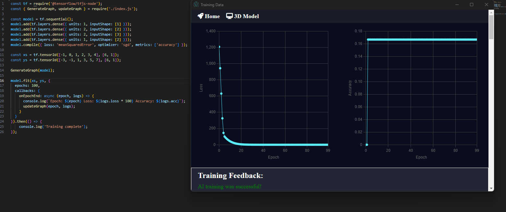

# NeuralGraph

NeuralGraph is an AI training data visualization tool that helps analyze and interpret training data for neural networks. It provides visualizations of loss and accuracy trends over epochs, allowing users to gain insights into the training process and assess the model's performance. When you call it simply create a popup app displaying the data.



## Features

- Line charts for loss and accuracy trends over epochs
- Calculation of average accuracy
- Feedback message indicating the success or failure of AI training
- Responsive and intuitive user interface

## Installation

Follow these steps to set up NeuralGraph:

1. Install:
   ```shell
   npm i neuralgraph
   ```
2. Call needed functions:
   ```js
   const { GenerateGraph, updateGraph } = require("neuralgraph");
   ```
3. Call this just before model.fit:
   ```js
   GenerateGraph();
   ```
4. Update your model.fit callback:
   ```js
   callbacks: {
     onEpochEnd: async (epoch, logs) => {
       console.log(
         `Epoch: ${epoch} Loss: ${logs.loss * 100} Accuracy: ${logs.acc}`
       );
      updateGraph(epoch, logs);
     };
   }
   ```

## Usage

To run NeuralGraph:

1. Start the development server:
 ```shell
 npm start
````

2. Open your web browser and navigate to `http://localhost:3001` to access NeuralGraph.

## Data Format

NeuralGraph expects training data in a specific format:

- `lossData`: An array of loss values corresponding to each epoch.
- `accuracyData`: An array of accuracy values corresponding to each epoch.

Example data format:

```json
{
  "lossData": [0.5, 0.4, 0.3, 0.2, 0.1],
  "accuracyData": [0.6, 0.7, 0.8, 0.9, 0.95]
}
```

## Example Tensorflow.js code

```js
const tf = require('@tensorflow/tfjs-node');
const { GenerateGraph, updateGraph } = require('neuralgraph');

const model = tf.sequential();
model.add(tf.layers.dense({ units: 1, inputShape: [1] }));
model.compile({ loss: 'meanSquaredError', optimizer: 'sgd', metrics: ['accuracy'] });

const xs = tf.tensor2d([-1, 0, 1, 2, 3, 4], [6, 1]);
const ys = tf.tensor2d([-3, -1, 1, 3, 5, 7], [6, 1]);

GenerateGraph();

model.fit(xs, ys, {
  epochs: 100,
  callbacks: {
    onEpochEnd: async (epoch, logs) => {
      console.log(`Epoch: ${epoch} Loss: ${logs.loss * 100} Accuracy: ${logs.acc}`);
      updateGraph(epoch, logs);
    }
  }
});
```

## Contributing

Contributions are welcome! To contribute to NeuralGraph, follow these steps:

1. Fork the repository.
2. Create a new branch for your feature or bug fix.
3. Make the necessary changes and commit them.
4. Push your changes to your forked repository.
5. Submit a pull request to the main repository.
6. Please ensure that your code follows the existing coding style and conventions.
