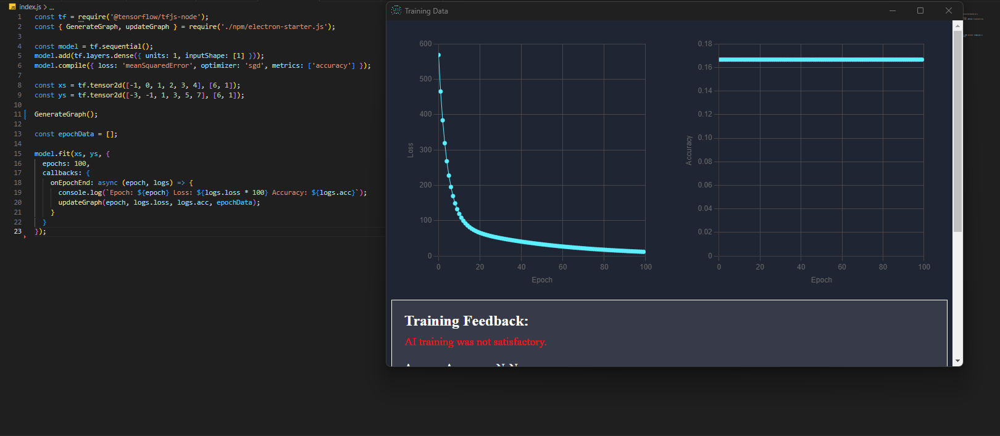

# NeuroGraph

NeuroGraph is an AI training data visualization tool that helps analyze and interpret training data for neural networks. It provides visualizations of loss and accuracy trends over epochs, allowing users to gain insights into the training process and assess the model's performance.



## Features

- Line charts for loss and accuracy trends over epochs
- Calculation of average accuracy
- Feedback message indicating the success or failure of AI training
- Responsive and intuitive user interface

## Installation

Follow these steps to set up NeuroGraph:

1. Clone the repository:
   \```shell
   git clone https://github.com/Frost-Lord/NeuroGraph.git
   \```
2. Open the project directory:
   \```shell
   cd NeuroGraph
   \```
3. Install the required dependencies:
   \```shell
   npm install
   \```

## Usage

To run NeuroGraph:

1. Start the development server:
   \```shell
   npm start
   \```
2. Open your web browser and navigate to `http://localhost:3001` to access NeuroGraph.

## Data Format

NeuroGraph expects training data in a specific format:

- `lossData`: An array of loss values corresponding to each epoch.
- `accuracyData`: An array of accuracy values corresponding to each epoch.

Example data format:

```json
{
  "lossData": [0.5, 0.4, 0.3, 0.2, 0.1],
  "accuracyData": [0.6, 0.7, 0.8, 0.9, 0.95]
}
```

## Contributing
Contributions are welcome! To contribute to NeuroGraph, follow these steps:

1. Fork the repository.
2. Create a new branch for your feature or bug fix.
3. Make the necessary changes and commit them.
4. Push your changes to your forked repository.
5. Submit a pull request to the main repository.
6. Please ensure that your code follows the existing coding style and conventions.